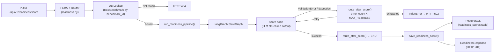

# Career Readiness Score — Feature Documentation

## Overview

The **Career Readiness Score** engine compares a structured candidate profile against a
persisted `RoleBenchmark` to produce:

- A composite **0–100 readiness score**
- **Dimensional sub-scores** across four axes
- A list of **critical gaps** (must-have skills and tools the candidate lacks)
- A list of **nice-to-have gaps** (preferred skills the candidate lacks)
- A list of **strengths** (areas where the candidate meets or exceeds requirements)
- A **natural-language explanation** of the assessment with an actionable recommendation

---

## Architecture



| Layer | File | Responsibility |
|---|---|---|
| **API Endpoint** | [readiness.py](../../app/api/v1/readiness.py) | FastAPI route `POST /readiness/score` |
| **Service** | [readiness_score_service.py](../../app/services/readiness_score_service.py) | LangGraph pipeline, persistence |
| **State** | `ReadinessState` (TypedDict) | Mutable data shared between nodes |
| **Schemas** | [readiness_score.py](../../app/schemas/readiness_score.py) | Pydantic v2 request/response + LLM output |
| **ORM Model** | [readiness_score.py](../../app/models/readiness_score.py) | SQLModel `readiness_scores` table |
| **Prompt** | [readiness_gap_analysis.md](../app/core/prompts/readiness_gap_analysis.md) | LLM system prompt |
| **LLM Gateway** | [registry.py](../../app/ai/registry.py) | `LLMServiceRegistry` (shared singleton) |

---

## Scoring Rubric

The LLM is instructed to score candidates across four dimensions:

| Dimension | Max Points | What is measured |
|---|---|---|
| **Must-Have Skills** | 40 | Conceptual / domain skill coverage against `benchmark.must_have_skills` |
| **Required Tools** | 25 | Named technology coverage against `benchmark.required_tools` |
| **Experience Level** | 25 | `candidate.experience_years` vs `benchmark.minimum_years` |
| **Soft Skills & Education** | 10 | Breadth of skills, education, alignment with responsibilities |
| **Total** | **100** | |

> [!NOTE]
> Scoring uses **semantic matching** — "RESTful API design" covers "API design principles".
> Tool matching is **case-insensitive and version-agnostic** — "Python 3.11" matches "Python".

---

## Gap Classification

| Gap Type | Source | Meaning |
|---|---|---|
| **Critical gap** | `benchmark.must_have_skills` + `benchmark.required_tools` | Primary hiring blocker; candidate lacks this item |
| **Nice-to-have gap** | `benchmark.nice_to_have_skills` | Growth opportunity; non-blocking |

---

## API Reference

### Request — `POST /api/v1/readiness/score`

```json
{
  "benchmark_id": 42,
  "candidate_profile": {
    "skills": [
      "System design",
      "API design principles",
      "Distributed systems"
    ],
    "tools": [
      "Python",
      "FastAPI",
      "Docker",
      "PostgreSQL"
    ],
    "experience_years": 3,
    "education": [
      "BSc Computer Science — Cairo University"
    ]
  }
}
```

> [!IMPORTANT]
> `benchmark_id` must be the integer `id` returned by `POST /api/v1/benchmarks/analyze`.

### Response — `ReadinessResponse` (HTTP 201)

```json
{
  "id": 99,
  "benchmark_id": 42,
  "created_at": "2026-06-28T08:21:00Z",
  "reviewed_at": null,
  "overall_score": 78,
  "sub_scores": {
    "must_have_skills_score": 32,
    "tools_score": 21,
    "experience_score": 20,
    "soft_skills_score": 5
  },
  "critical_gaps": [
    "Kubernetes / container orchestration"
  ],
  "nice_to_have_gaps": [
    "GraphQL"
  ],
  "strengths": [
    "Strong Python and FastAPI expertise matching core backend requirements",
    "Docker containerization experience",
    "PostgreSQL database management"
  ],
  "explanation": "The candidate scores 78/100 against this Senior Backend Engineer benchmark. Their primary blocker is the absence of Kubernetes experience, which is a must-have for managing containerised workloads at scale. A focused Kubernetes certification (CKA or CKAD) would directly address this critical gap and materially improve hiring readiness."
}
```

### Custom Response Header

| Header | Value | Purpose |
|---|---|---|
| `X-Readiness-Score-Id` | `"99"` | Database PK of the persisted score record; useful for audit/tracing |

---

## Error Handling

| Condition | HTTP Status | Detail |
|---|---|---|
| `benchmark_id` not in database | `404 Not Found` | Friendly message with link to `/benchmarks/analyze` |
| Pydantic validation failure on request | `422 Unprocessable Entity` | Field-level error list |
| LLM exhausts `MAX_RETRIES` (3) | `502 Bad Gateway` | Error message from `ValueError` |
| LLM rate limit hit | `503 Service Unavailable` | Retry-after hint |
| LLM authentication failure | `502 Bad Gateway` | Check `LITELLM_API_KEY` |
| LLM API error | `502 Bad Gateway` | LLM error message |
| Database commit failure | `500 Internal Server Error` | Generic internal error |

---

## Internal State Flow (`ReadinessState`)

The LangGraph state dictionary tracks data across the pipeline:

```python
class ReadinessState(TypedDict):
    request:           ReadinessRequest          # Input — injected by service
    benchmark:         Optional[RoleBenchmarkModel]  # Loaded from DB before pipeline
    analysis:          Optional[ReadinessGapAnalysis]  # ← Populated by score node
    error_count:       int                       # Retry counter
    validation_errors: List[str]                 # Accumulated error messages
```

---

## Database Schema

```sql
CREATE TABLE readiness_scores (
    id                        SERIAL PRIMARY KEY,
    benchmark_id              INTEGER NOT NULL,       -- FK → role_benchmarks.id
    overall_score             INTEGER NOT NULL,       -- [0, 100]
    must_have_skills_score    INTEGER NOT NULL,       -- [0, 40]
    tools_score               INTEGER NOT NULL,       -- [0, 25]
    experience_score          INTEGER NOT NULL,       -- [0, 25]
    soft_skills_score         INTEGER NOT NULL,       -- [0, 10]
    critical_gaps             JSONB NOT NULL,         -- list[str]
    nice_to_have_gaps         JSONB NOT NULL,         -- list[str]
    strengths                 JSONB NOT NULL,         -- list[str]
    explanation               TEXT NOT NULL,
    candidate_skills          JSONB NOT NULL,         -- audit snapshot
    candidate_tools           JSONB NOT NULL,         -- audit snapshot
    candidate_experience_years INTEGER NOT NULL,      -- audit snapshot
    created_at                TIMESTAMP NOT NULL DEFAULT NOW(),
    reviewed_at               TIMESTAMP               -- NULL until reviewed
);
```

> [!TIP]
> Add `CREATE INDEX ON readiness_scores (benchmark_id)` for efficient filtering by benchmark.

---

## Prometheus Metrics

| Metric name | Type | Description |
|---|---|---|
| `readiness_scoring_latency_seconds` | Histogram | End-to-end duration of the LLM scoring pipeline |

Scrape at `GET /metrics` (requires `prometheus_client` middleware, already present in the project).

---

## Retry & Error Policy

The pipeline retries the LLM call up to `MAX_RETRIES = 3` times on any exception
(including `ValidationError` from structured-output parsing).

```
Attempt 1 ──► fail ──► error_count = 1 ──► retry
Attempt 2 ──► fail ──► error_count = 2 ──► retry
Attempt 3 ──► fail ──► error_count = 3 ──► ValueError (surface as HTTP 502)
```

All error messages are accumulated in `state["validation_errors"]` and included in the
`ValueError` message for debugging.

---

## Security Notes

- No PII is stored in the `readiness_scores` table. The `candidate_skills`,
  `candidate_tools`, and `candidate_experience_years` fields are functional
  (for audit/reproduction) and contain no personal identifiers.
- The `LITELLM_API_KEY` is sourced from the environment variable, never hardcoded.
- The `benchmark_id` is validated with `gt=0` at the Pydantic layer before any DB query.

---

## Known Limitations

> [!WARNING]
> These are known limitations in the current implementation:

| Limitation | Details |
|---|---|
| **No human review endpoint** | `reviewed_at` is set to `NULL` on creation; no `PATCH /readiness/{id}/review` endpoint exists yet |
| **Single-candidate evaluation** | No batch scoring or ranking across multiple candidates |
| **No benchmark version tracking** | If a benchmark record is updated, past scores are not re-calculated |
| **Score is advisory only** | The LLM may hallucinate skill coverage or miss semantic equivalences |
| **No embedding-based matching** | Gap analysis uses text-level matching only, not vector similarity |

---

## Integration Example

```python
import httpx

# Step 1: Extract a benchmark
benchmark_resp = httpx.post(
    "http://localhost:8000/api/v1/benchmarks/analyze",
    content="We are hiring a Senior Backend Engineer with 3-5 years Python...",
    headers={"Content-Type": "text/plain"},
)
benchmark_id = benchmark_resp.json()["id"]

# Step 2: Score a candidate
score_resp = httpx.post(
    "http://localhost:8000/api/v1/readiness/score",
    json={
        "benchmark_id": benchmark_id,
        "candidate_profile": {
            "skills": ["System design", "API design principles"],
            "tools": ["Python", "FastAPI", "Docker"],
            "experience_years": 3,
            "education": ["BSc Computer Science"],
        },
    },
)
print(score_resp.json()["overall_score"])   # e.g. 78
print(score_resp.json()["critical_gaps"])   # e.g. ["Kubernetes"]
```
