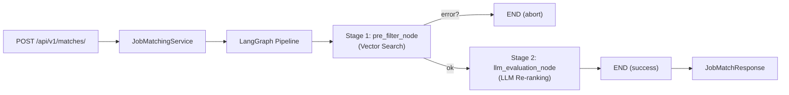
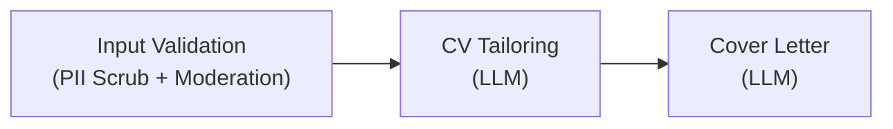

# Skill Matching Engine — Current Output

## 1. Architecture Overview

The skill matching engine is a **two-stage pipeline** orchestrated by LangGraph:



| Layer | File | Responsibility |
|---|---|---|
| **API Endpoint** | [matches.py](file:///c:/Users/hp/Desktop/sprint-internship/career-coach-agent/app/api/v1/matches.py) | FastAPI route `POST /matches/` |
| **Service** | [job_matching_service.py](file:///c:/Users/hp/Desktop/sprint-internship/career-coach-agent/app/services/job_matching_service.py) | Injects DB + request into the graph |
| **Graph** | [graph.py](file:///c:/Users/hp/Desktop/sprint-internship/career-coach-agent/app/ai/graph.py) | Compiles the LangGraph `StateGraph` |
| **Nodes** | [nodes.py](file:///c:/Users/hp/Desktop/sprint-internship/career-coach-agent/app/ai/nodes.py) | `pre_filter_node` + `llm_evaluation_node` |
| **State** | [state.py](file:///c:/Users/hp/Desktop/sprint-internship/career-coach-agent/app/ai/state.py) | `MatchingState` TypedDict |
| **Schemas** | [matching.py](file:///c:/Users/hp/Desktop/sprint-internship/career-coach-agent/app/schemas/matching.py) | Pydantic request/response models |
| **Prompts** | [prompts.py](file:///c:/Users/hp/Desktop/sprint-internship/career-coach-agent/app/ai/prompts.py) + [job_matching.md](file:///c:/Users/hp/Desktop/sprint-internship/career-coach-agent/app/core/prompts/job_matching.md) | LLM prompt templates |
| **Rubric** | [matching_rubric.md](file:///c:/Users/hp/Desktop/sprint-internship/career-coach-agent/app/ai/matching_rubric.md) | 40/30/20/10 scoring rubric |
| **LLM Service** | [llm.py](file:///c:/Users/hp/Desktop/sprint-internship/career-coach-agent/app/core/llm.py) | LiteLLM proxy (completion + embedding) |
| **DB Repository** | [repositories.py](file:///c:/Users/hp/Desktop/sprint-internship/career-coach-agent/app/db/repositories.py) | `JobRepository` (abstract) + `InMemoryJobRepository` |

---

## 2. Pipeline Stages

### Stage 1 — Vector Pre-Filter (`pre_filter_node`)
1. Looks up the target job by `job_id` from the database
2. Generates an embedding of the candidate's skills + experience using `text-embedding-ada-002` via LiteLLM
3. Performs L2 vector search across all stored jobs (`vector_search_jobs`)
4. Extracts the **vector distance** between the candidate and the target job

### Stage 2 — LLM Evaluation (`llm_evaluation_node`)
1. Loads the system prompt from `app/core/prompts/job_matching.md` (falls back to `JOB_MATCHING_PROMPT` in `prompts.py`)
2. **Scrubs PII** — redacts candidate name and contact info before sending to the LLM
3. Sends candidate profile + job description to the LLM (`azure/FW-Kimi-K2.6` by default)
4. Parses the structured JSON response into `JobMatchResult`

---

## 3. Scoring Rubric (100 Points)

| Category | Max Points | Weight |
|---|---|---|
| Hard Skills Fit | 40 | 40% |
| Experience Level Fit | 30 | 30% |
| Soft Skills & Domain Knowledge | 20 | 20% |
| Career Preferences & Logistics | 10 | 10% |

---

## 4. Request / Response Schemas

### Request — `POST /api/v1/matches/`

```json
{
  "candidate_id": "550e8400-e29b-41d4-a716-446655440001",
  "job_id": "550e8400-e29b-41d4-a716-446655440002",
  "candidate_profile": {
    "name": "Ahmed Hassan",
    "contact": {
      "email": "ahmed@example.com",
      "phone": "+201234567890"
    },
    "skills": ["Python", "FastAPI", "Docker", "PostgreSQL", "React", "Git"],
    "experience_years": 3,
    "education": ["BSc Computer Science - Cairo University"],
    "preferences": {
      "job_titles": ["Backend Developer", "Full Stack Developer"],
      "location": "Remote"
    }
  }
}
```

### Response — `JobMatchResponse`

```json
{
  "job_id": "550e8400-e29b-41d4-a716-446655440002",
  "candidate_id": "550e8400-e29b-41d4-a716-446655440001",
  "result": {
    "score_details": {
      "hard_skills_score": 32,
      "experience_score": 22,
      "soft_skills_score": 14,
      "logistics_score": 8
    },
    "total_score": 76,
    "explanation": "The candidate demonstrates strong proficiency in Python, FastAPI, and Docker which are core requirements for this role. Their 3 years of experience falls slightly below the 4-year minimum, but their hands-on work with PostgreSQL and containerization shows practical depth. Soft skills evidence is implicit through collaborative project descriptions. Remote preference aligns well with the hybrid model offered.",
    "strengths": [
      "Strong Python and FastAPI expertise matching the backend requirements",
      "Docker and containerization experience",
      "PostgreSQL database management skills",
      "Full-stack capability with React knowledge"
    ],
    "missing_skills": [
      "Kubernetes / container orchestration",
      "CI/CD pipeline experience (Jenkins/GitHub Actions)",
      "Message queue systems (RabbitMQ/Kafka)"
    ],
    "recommendation": "Consider taking a short Kubernetes certification course to demonstrate container orchestration skills. Additionally, setting up a CI/CD pipeline for a personal project using GitHub Actions would directly address the gap in DevOps tooling."
  },
  "vector_distance": 0.12
}
```

---

## 5. Internal State Flow (`MatchingState`)

The LangGraph state dictionary tracks data across nodes:

```python
class MatchingState(TypedDict):
    request: MatchRequest            # Input — injected by service
    db: Any                          # Database dependency
    target_job: Optional[Any]        # ← Populated by pre_filter_node
    vector_distance: Optional[float] # ← Populated by pre_filter_node
    llm_result: Optional[JobMatchResult]  # ← Populated by llm_evaluation_node
    error: Optional[str]             # ← Populated on abort/error
```

---

## 6. Error Handling

| Condition | Behavior |
|---|---|
| `job_id` not found in DB | Graph aborts → `error` set → HTTP `404 Not Found` |
| Embedding generation fails | Falls back to zero vector `[0.0] * 1536` + logs warning |
| LLM call or JSON parsing fails | Returns zeroed-out `JobMatchResult` with error explanation |
| Content moderation block (Application AI) | Graph aborts → HTTP `400` |
| Any other exception | HTTP `500 Internal Server Error` |

---

## 7. Security Measures

- **PII Scrubbing**: Candidate `name` → `"REDACTED"`, `contact` → `{}` before LLM inference
- **API Key Protection**: `LITELLM_API_KEY` stored only in `.env`, never hardcoded
- **Content Moderation**: Blocked keywords filter on job descriptions (Application AI pipeline)

---

## 8. Current Limitations

> [!WARNING]
> These are known limitations in the current implementation:

| Limitation | Details |
|---|---|
| **In-Memory DB only** | `InMemoryJobRepository` is used — no persistent PostgreSQL/pgvector integration yet |
| **Hardcoded fallback distance** | If target job isn't found in vector results, defaults to `0.12` |
| **No main app entry point** | No `main.py` or `app/__init__.py` wiring the FastAPI app + router together |
| **Embedding model fixed** | Hardcoded to `text-embedding-ada-002` — not configurable via env |
| **No retry/circuit-breaker** | LLM calls have no retry logic or circuit-breaker pattern |
| **Single candidate evaluation** | No batch matching or ranking across multiple candidates |

---

## 9. Companion Pipeline — Application AI Service

A second LangGraph pipeline exists in [application_ai_service.py](file:///c:/Users/hp/Desktop/sprint-internship/career-coach-agent/app/services/application_ai_service.py) with 3 stages:



This generates `CVTailoringResult` + `CoverLetterResult` using the same LiteLLM infrastructure and prompt templates at [cv_tailoring.md](file:///c:/Users/hp/Desktop/sprint-internship/career-coach-agent/app/core/prompts/cv_tailoring.md) and [cover_letter.md](file:///c:/Users/hp/Desktop/sprint-internship/career-coach-agent/app/core/prompts/cover_letter.md).
